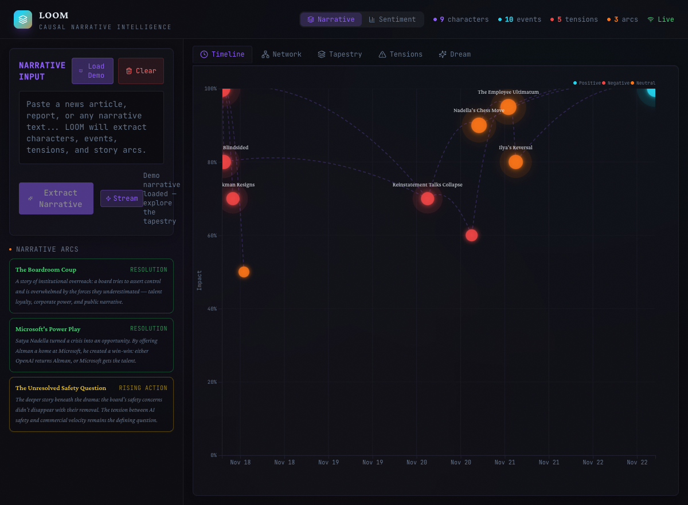
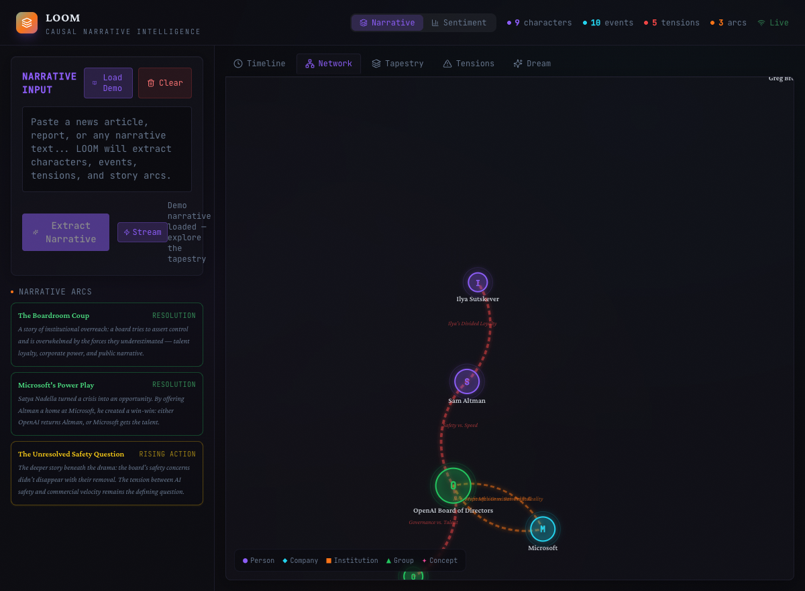
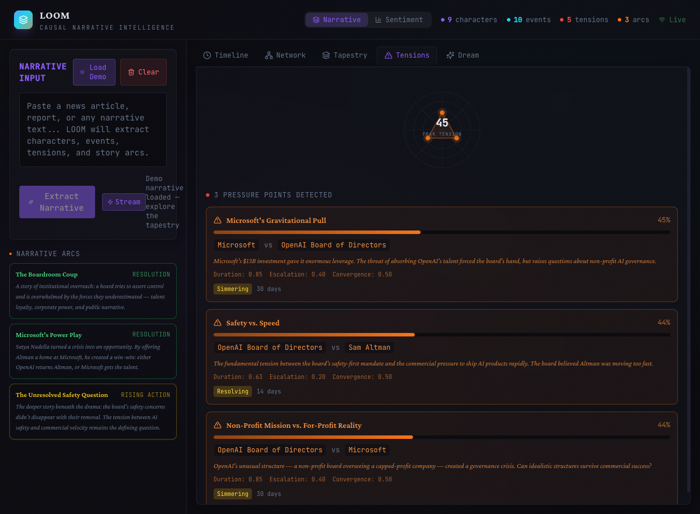
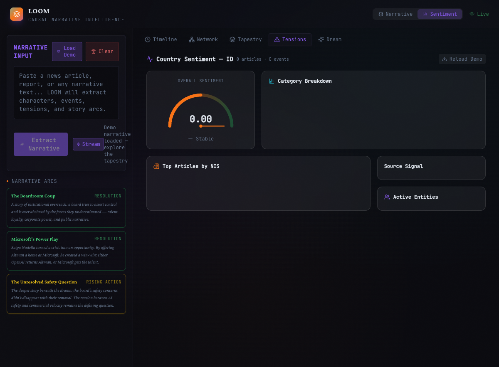

# LOOM — Causal Narrative Intelligence Engine

> **What if you could read the plot of reality in real-time?**

**33,700+ lines of TypeScript. 624 passing tests. 16 source profiles. MCP-enabled. Zero `any` types.**

Most analytics tools show you _what happened_. LOOM shows you _the story_ — who the characters are, what tensions are building, which subplots everyone stopped watching, and what happens next.

Feed it news articles, earnings calls, intelligence reports, or any unstructured text. LOOM extracts the **narrative skeleton** — characters with motivations, events in causal chains, tensions with cascade risk, and story arcs following classical patterns — then dreams plausible futures as explorable branches.

It's not a dashboard. It's a **narrative lens**.

```
$ curl -X POST localhost:3001/api/extract -d '{"text": "..."}'
→ 9 characters, 10 events, 5 tensions, 3 arcs detected
→ "Safety vs. Speed" tension at 0.87 — cascade risk: HIGH
→ Climax predicted in 4-7 days based on escalation rate
```

---

## Why LOOM?

Every dataset is a story someone stopped reading too early.

Traditional analytics reduces the world to numbers on a dashboard — time series, KPIs, anomaly scores. These tools answer "what" and "how much" but systematically strip away the _narrative structure_ that actually drives outcomes: who wants what, who's blocking whom, which tensions are about to break, and which quiet subplots are where the real risk hides.

Humans have understood the world through narrative for 100,000 years. Stories aren't a simplification of reality — they're the **native data structure of human behavior**. When a CEO makes a decision, they're not optimizing a loss function. They're acting as a _character_ with motivations, alliances, and constraints, inside a _plot_ that has momentum and logic.

LOOM takes this seriously. It applies the same structural mechanics that drive novels, films, and history — character arcs, rising tension, climax prediction, subplot detection — as an **analytical framework for real-world data**.

The result is intelligence that reads the way analysts actually think: _"This tension between X and Y has been escalating for 28 days, it's converging with two other pressure points, and based on the arc pattern, we're 70% through the rising action."_

That's not a metric. That's a briefing.

**Narrative intelligence matters because:**

- **Unresolved tensions are early-warning signals.** A dashboard shows you the explosion. LOOM shows you the fuse.
- **Character arc shifts predict behavior.** When an entity breaks pattern, something changed in their calculus. That's signal.
- **Subplots everyone stopped tracking are where risk hides.** The boring storyline that went quiet didn't resolve — it went underground.
- **Narratives that don't cohere structurally are worth investigating.** If the story doesn't make sense, someone is lying or something is missing.

---

## Screenshots

### Timeline View — Causal Event Chains



### Network Graph — Entity Relationships



### 3D Tapestry — Cinematic Narrative Space


### Tension Radar — Pressure Points



### Sentiment Dashboard — Country-Level Analysis



---

## What Makes This Different

| Traditional Analytics   | LOOM                                                                 |
| ----------------------- | -------------------------------------------------------------------- |
| Entities in a database  | **Characters** with motivations and alliances                        |
| Timestamped data points | **Events** in causal chains                                          |
| KPI thresholds          | **Tension scores** with cascade risk                                 |
| Static dashboards       | **The Tapestry** — a cinematic 3D narrative space                    |
| Linear forecasts        | **Dream branches** — speculative futures grounded in character logic |
| Anomaly detection       | **Plot twist detection** — structural breaks in narrative coherence  |

---

## Architecture

```
                              ┌─────────────────────────────────────────┐
                              │            LOOM Architecture            │
                              └─────────────────────────────────────────┘

  ┌──────────────────┐     ┌──────────────────────────────────────────────────────────┐
  │   Input Sources   │     │                    packages/server                       │
  │                    │     │                                                          │
  │  News Articles     │     │  ┌──────────────┐   ┌──────────────┐   ┌─────────────┐ │
  │  Earnings Calls    │────▶│  │  Extraction   │──▶│  Temporal     │──▶│  Analysis   │ │
  │  Intel Reports     │     │  │  Pipeline     │   │  Causal Graph │   │  Engine     │ │
  │  Any Text          │     │  │  (GPT-4o)     │   │  (In-Memory)  │   │            │ │
  └──────────────────┘     │  └──────────────┘   └──────┬───────┘   └──────┬──────┘ │
                              │         │                  │                  │         │
  ┌──────────────────┐     │         │           ┌──────┴───────┐   ┌──────┴──────┐ │
  │   MCP Clients     │     │         ▼           │   Entities    │   │  Tension    │ │
  │                    │     │  ┌──────────────┐  │   Events      │   │  Radar      │ │
  │  Claude Desktop    │◀──▶│  │  MCP Server   │  │   Tensions    │   │  Arc        │ │
  │  GPT Agents        │     │  │  (8 tools)    │  │   Arcs        │   │  Detector   │ │
  │  Custom Agents     │     │  └──────────────┘  │   Alliances   │   │  Dream      │ │
  └──────────────────┘     │                     └──────────────┘   │  Engine     │ │
                              │                                        └─────────────┘ │
  ┌──────────────────┐     │  ┌──────────────────────────────────────────────────┐   │
  │   News Feeds       │     │  │              Sentiment Engine                    │   │
  │                    │     │  │                                                    │   │
  │  RSS Feeds         │────▶│  │  ┌──────────┐  ┌───────────┐  ┌──────────────┐ │   │
  │  SerpAPI           │     │  │  │ 16 Source │  │ NIS Score │  │ Knowledge    │ │   │
  │  Google News       │     │  │  │ Profiles  │  │ Breakdown │  │ Base +       │ │   │
  │  Firecrawl         │     │  │  │ (weighted)│  │ (0-100)   │  │ Entity       │ │   │
  └──────────────────┘     │  │  └──────────┘  └───────────┘  │ Profiles     │ │   │
                              │  │                                └──────────────┘ │   │
                              │  └──────────────────────────────────────────────────┘   │
                              │                                                          │
                              │  ┌────────────────┐  ┌───────────────┐                  │
                              │  │  Express API    │  │  WebSocket    │                  │
                              │  │  30+ endpoints  │  │  Real-time +  │                  │
                              │  │  Zod validated  │  │  Streaming    │                  │
                              │  └───────┬────────┘  └───────┬───────┘                  │
                              └──────────┼──────────────────┼──────────────────────────┘
                                           │                  │
                              ┌──────────┼──────────────────┼──────────────────────────┐
                              │          ▼                  ▼        packages/client     │
                              │                                                          │
                              │  ┌──────────────┐  ┌──────────────┐  ┌──────────────┐  │
                              │  │  3D Tapestry  │  │  D3 Timeline │  │  Network     │  │
                              │  │  Three.js     │  │  Causal      │  │  Graph       │  │
                              │  │  Bloom + Fog  │  │  Curves      │  │  Force-dir.  │  │
                              │  └──────────────┘  └──────────────┘  └──────────────┘  │
                              │                                                          │
                              │  ┌──────────────┐  ┌──────────────┐  ┌──────────────┐  │
                              │  │  Tension      │  │  Sentiment   │  │  Knowledge   │  │
                              │  │  Radar        │  │  Dashboard   │  │  Base UI     │  │
                              │  │  Heatmap      │  │  NIS + Trend │  │  Sources +   │  │
                              │  └──────────────┘  └──────────────┘  │  Entities    │  │
                              │                                        └──────────────┘  │
                              │  ┌──────────────┐  ┌──────────────┐                     │
                              │  │  Dream Tree   │  │  Score        │                     │
                              │  │  Branch       │  │  Transparency │                     │
                              │  │  Explorer     │  │  Breakdown    │                     │
                              │  └──────────────┘  └──────────────┘                     │
                              │                                                          │
                              │         React 18 + Vite + Tailwind (Dark Theme)         │
                              └──────────────────────────────────────────────────────────┘
```

### Data Flow

```
  Text Input                 Extraction              Graph                Analysis
  ─────────                  ──────────              ─────                ────────

  "Board fires    ──▶  GPT-4o extracts:   ──▶  Temporal graph   ──▶  Tension Radar
   Sam Altman"        • 9 entities              indexes by:          scores 6 dimensions
                       • 10 events              • entity ID          per tension
                       • 5 tensions             • timestamp
                       • 3 arcs                 • causal links     Arc Detector
                                                                     matches 6 classical
                                                                     archetypes

                                                                    Dream Engine
                                                                     3 strategies →
                                                                     constraint filter →
                                                                     explorable branches
```

---

## Core Capabilities

### Story Extraction

Feed LOOM any text and it extracts the **narrative skeleton** via GPT-4o: characters and their motivations, events and their causal chains, conflicts and their trajectory. The extraction pipeline identifies entities, maps alliances, scores impact and sentiment, and links events into causal graphs. Supports both REST and **streaming WebSocket** extraction with real-time progress.

### Tension Radar

Real-time scanning for unresolved narrative tensions — contradictions, building pressures, unstable equilibria. Each tension is scored across six dimensions: intensity, duration decay, escalation rate, convergence with other tensions, momentum, and **cascade risk** (the probability that one tension breaking triggers others).

### Arc Detector

Automatic detection of narrative phases (setup, rising action, climax, falling action, resolution) with **archetype matching** against six classical story patterns: Tragedy, Comedy, Hero's Journey, Rags to Riches, Rebirth, and Overcoming the Monster. Includes subplot detection, health scoring, and climax prediction.

### Dream Engine

Multi-strategy speculative generation that produces plausible "next chapters" as explorable story branches. Three strategies — conservative extrapolation, wild card disruptions, and pattern-based projection — filtered through constraint satisfaction, motivation alignment, and temporal coherence checks.

### Score Transparency System

Every computed metric in LOOM — tension scores, arc health, NIS, sentiment — is fully decomposable. The score transparency system exposes the raw value, normalized value, weight, and weighted contribution of every variable in every score. No black boxes. Every number has a receipt.

### Knowledge Base

Structured intelligence profiles for entities and media sources. 16 Indonesian media source profiles with ownership chains, political leanings, reliability scores, and editorial histories. 9+ entity profiles with relationship maps, public stances, and historical positions. The knowledge base powers the source-weighted sentiment analysis and enables pattern detection across ownership networks.

### The Tapestry

A cinematic Three.js visualization where characters orbit as glowing spheres, tensions pulse as luminous threads between them, events scatter like stars along a flowing time river, and bloom effects light the narrative space. Fog, particles, and smooth camera motion at 60fps.

### D3 Visualizations

Force-directed network graphs showing entity relationships and alliances. Timeline views with causal curves connecting events. Tension radar heatmaps showing pressure distribution across the narrative.

---

## Country Sentiment Engine

LOOM includes a **precision sentiment measurement instrument** for country-level narrative analysis. Starting with Indonesia, it ingests real news, measures impact with source-weighted scoring, and enables predictive analysis.

### How It Works

| Step           | What Happens                                                                                         |
| -------------- | ---------------------------------------------------------------------------------------------------- |
| **Ingest**     | Feed articles from multiple news sources (RSS, SerpAPI, Google News, Firecrawl, manual)              |
| **Categorize** | Auto-classify into 12 categories (political, economic, corruption, etc.)                             |
| **Score**      | Multi-strategy sentiment scoring (lexicon + LLM) with bilingual support (English + Bahasa Indonesia) |
| **Weight**     | Source-weighted scoring — unexpected sentiment from biased sources is amplified                      |
| **Measure**    | Before/after impact measurement, time-series tracking, moving averages                               |
| **Predict**    | Historical pattern matching to predict impact of future events                                       |

### Source-Weighted Sentiment (The Key Insight)

Not all sources are equal. The **same event** reported by different sources tells you different things:

| Source                   | Type                      | If They Report Positively on Government    | Signal |
| ------------------------ | ------------------------- | ------------------------------------------ | ------ |
| **Tempo** (opposition)   | Independent investigative | Unexpected → **HIGH signal** (2.5x weight) | Strong |
| **Antara** (state media) | Government wire service   | Expected → **LOW signal** (0.5x weight)    | Weak   |
| **Kompas** (centrist)    | Quality broadsheet        | Baseline signal (1.0x weight)              | Normal |

A positive article about Prabowo from Tempo is worth **5x** a positive article from Antara.

### Narrative Impact Score (NIS)

Every article gets a **NIS** (0-100) combining:

- **Sentiment shift** magnitude (0-20)
- **Source credibility** and signal weight (0-20)
- **Audience reach** across segments (0-20)
- **Impact duration** estimate (0-20)
- **Cross-source amplification** (0-20)

### Indonesian Media Profiles (16 Sources)

| Source          | Owner                          | Bias                 | Reliability | Audience             |
| --------------- | ------------------------------ | -------------------- | ----------- | -------------------- |
| Kompas          | Kompas Gramedia                | Centrist             | 0.85        | Elite, Urban         |
| Tempo           | Independent                    | Anti-gov             | 0.90        | Elite, International |
| Detik           | CT Corp (Chairul Tanjung)      | Pro-gov              | 0.60        | Urban, Youth         |
| Jakarta Post    | Independent                    | Progressive          | 0.82        | International        |
| Antara          | State                          | Pro-gov              | 0.55        | Elite, Rural         |
| Republika       | Bakrie Group                   | Islamic Conservative | 0.60        | Urban, Rural         |
| Kumparan        | Independent                    | Neutral              | 0.65        | Youth                |
| CNN Indonesia   | CT Corp                        | Pro-gov              | 0.70        | Urban, Youth         |
| tvOne/Viva      | Bakrie Group                   | Pro-gov              | 0.45        | Rural, Urban         |
| Media Indonesia | Surya Paloh (NasDem)           | Pro-gov              | 0.50        | Elite                |
| Tribunnews      | Kompas Gramedia                | Neutral              | 0.65        | Mass market          |
| MNC Media       | Hary Tanoesoedibjo (MNC Group) | Pro-gov              | 0.50        | Mass market          |
| EMTEK Media     | Emtek Group                    | Centrist             | 0.60        | Urban, Youth         |
| Berita Satu     | Lippo Group                    | Pro-business         | 0.55        | Elite, Business      |
| Tirto.id        | Independent                    | Neutral              | 0.80        | Youth, Urban         |
| Narasi TV       | Najwa Shihab                   | Independent          | 0.78        | Youth, Urban         |

### Event Detail Analysis

Click any article/event to see:

- **NIS Score** with full component breakdown (score transparency)
- **Sentiment Types** — 8 emotional dimensions (fear, hope, anger, trust, pride, confusion, urgency, apathy)
- **Effectiveness Analysis** — source credibility, timing, framing quality, emotional resonance, novelty
- **Audience Impact** — which demographics are affected (elite, urban, rural, international, youth)
- **Downstream Effects** — policy support, investor sentiment, social amplification, political pressure

---

## Demo Scenarios

LOOM ships with four pre-loaded narrative scenarios. Load any of them in one click.

### 1. The OpenAI Board Crisis (November 2023)

- **9 characters** — Sam Altman, the Board, Ilya Sutskever, Satya Nadella, and more
- **10 key events** with full causal chains
- **5 active tensions** from "Safety vs. Speed" to "Non-Profit vs. For-Profit"
- **3 narrative arcs** including "The Boardroom Coup" and "Microsoft's Power Play"

### 2. US-China Semiconductor War

- **8 entities** — US Government, China, NVIDIA, Huawei, TSMC, SMIC, ASML, Indonesia
- **10 events** — Export controls, Huawei's breakthrough, TSMC Arizona, critical minerals retaliation
- **4 tensions** — Tech Decoupling vs. Interdependence, NVIDIA's China Dilemma, Taiwan Strait Risk
- **3 arcs** — The Semiconductor Iron Curtain, China's Great Leap Inward, Southeast Asia's Leverage Play

### 3. NVIDIA & The AI Bubble Question

- **6 entities** — NVIDIA, Microsoft, OpenAI, DeepSeek, Meta, Wall Street
- **8 events** — NVIDIA earnings triple, DeepSeek $6M shock, Goldman bubble warning
- **3 tensions** — AI Capex vs. Revenue, Proprietary vs. Open Source, Pricing Power vs. Efficiency
- **3 arcs** — The AI Gold Rush, The Efficiency Insurgency, OpenAI's Existential Race

### 4. Indonesian Sentiment Engine Demo

- **50+ articles** across 16 Indonesian media sources
- Covers Prabowo's first 100 days, IKN, economic policy, South China Sea, anti-corruption
- Source-weighted sentiment analysis with NIS (Narrative Impact Score) for every article
- Full score transparency breakdowns showing how every number was computed

---

## Quick Start

### With npm

```bash
# Clone and install
git clone https://github.com/jarviscommand-rgb/loom.git
cd loom
npm install          # Installs all workspace dependencies

# Configure
cp .env.example .env
# Edit .env and add your OPENAI_API_KEY

# Start both server (port 3001) and client (port 5173)
npm run dev
```

### With Docker

```bash
docker compose up
```

Then open **http://localhost:5173** and click **"Load Demo"** to explore the OpenAI crisis narrative.

### Environment Variables

| Variable                    | Required | Default  | Description                                    |
| --------------------------- | -------- | -------- | ---------------------------------------------- |
| `OPENAI_API_KEY`            | Yes      | —        | OpenAI API key for extraction and dream engine |
| `PORT`                      | No       | `3001`   | Server port                                    |
| `OPENAI_MODEL`              | No       | `gpt-4o` | Model for narrative extraction                 |
| `DREAM_MODEL`               | No       | `gpt-4o` | Model for dream generation                     |
| `LOG_LEVEL`                 | No       | `info`   | `debug` \| `info` \| `warn` \| `error`         |
| `RATE_LIMIT_MAX`            | No       | `10`     | Max requests per rate limit window             |
| `RATE_LIMIT_WINDOW_MINUTES` | No       | `1`      | Rate limit window in minutes                   |
| `MAX_INPUT_LENGTH`          | No       | `50000`  | Max characters for extraction input            |
| `SERPAPI_KEY`               | No       | —        | SerpAPI key for auto-research ingestion        |
| `FIRECRAWL_API_KEY`         | No       | —        | Firecrawl key for web content extraction       |

---

## API Documentation

### Interactive API Docs (Swagger UI)

LOOM ships with auto-generated OpenAPI 3.0 documentation. Start the server and visit:

- **Swagger UI:** [http://localhost:3000/api-docs](http://localhost:3000/api-docs)
- **Raw JSON spec:** [http://localhost:3000/api-docs/json](http://localhost:3000/api-docs/json)

All endpoints, request/response schemas, and query parameters are documented interactively.

### Endpoints

Base URL: `/api`

### Graph State

| Method | Endpoint               | Description                             |
| ------ | ---------------------- | --------------------------------------- |
| `GET`  | `/graph`               | Full narrative graph snapshot           |
| `GET`  | `/graph/at/:timestamp` | Graph state at a specific point in time |

```json
// GET /api/graph
{
  "entities": [...],
  "events": [...],
  "tensions": [...],
  "arcs": [...],
  "timestamp": "2024-01-15T10:30:00.000Z"
}
```

### Entities

| Method | Endpoint                                  | Description                |
| ------ | ----------------------------------------- | -------------------------- |
| `GET`  | `/entities?limit=100&offset=0`            | Paginated entity list      |
| `GET`  | `/entities/:id`                           | Single entity by ID        |
| `GET`  | `/entities/:id/events?limit=100&offset=0` | Events involving an entity |

```json
// GET /api/entities?limit=2&offset=0
{
  "data": [
    {
      "id": "ent-001",
      "name": "Sam Altman",
      "type": "person",
      "motivation": "Accelerate AGI development while maintaining OpenAI's leadership",
      "capability": "CEO authority, industry influence, fundraising",
      "alliances": ["ent-008"],
      "description": "CEO of OpenAI",
      "firstSeen": "2023-11-01T00:00:00.000Z",
      "lastSeen": "2023-11-29T00:00:00.000Z"
    }
  ],
  "total": 9,
  "limit": 2,
  "offset": 0
}
```

### Events

| Method | Endpoint                        | Description            |
| ------ | ------------------------------- | ---------------------- |
| `GET`  | `/events?limit=100&offset=0`    | Paginated event list   |
| `GET`  | `/events/range?from=...&to=...` | Events in a time range |

```json
// GET /api/events?limit=1
{
  "data": [
    {
      "id": "evt-001",
      "title": "Board fires Sam Altman",
      "description": "OpenAI board terminates Sam Altman as CEO...",
      "timestamp": "2023-11-17T00:00:00.000Z",
      "participants": ["ent-001", "ent-002"],
      "causalPredecessors": [],
      "impact": 0.95,
      "sentiment": -0.8
    }
  ],
  "total": 10,
  "limit": 1,
  "offset": 0
}
```

### Tensions

| Method | Endpoint                       | Description                       |
| ------ | ------------------------------ | --------------------------------- |
| `GET`  | `/tensions?limit=100&offset=0` | All tensions (paginated)          |
| `GET`  | `/tensions/active`             | Active (unresolved) tensions only |

```json
// GET /api/tensions/active
[
  {
    "id": "ten-001",
    "name": "Safety vs. Speed",
    "description": "Fundamental conflict between AI safety research and rapid deployment...",
    "parties": ["ent-002", "ent-001"],
    "status": "critical",
    "intensity": 0.9,
    "duration": 28,
    "relatedEvents": ["evt-001", "evt-003"],
    "validFrom": "2023-11-01T00:00:00.000Z"
  }
]
```

### Arcs

| Method | Endpoint                   | Description                    |
| ------ | -------------------------- | ------------------------------ |
| `GET`  | `/arcs?limit=100&offset=0` | All narrative arcs (paginated) |

### Analysis

| Method | Endpoint                              | Description                          |
| ------ | ------------------------------------- | ------------------------------------ |
| `GET`  | `/analysis/pressure-points`           | Ranked tension risk scores           |
| `POST` | `/analysis/dream`                     | Generate speculative future branches |
| `GET`  | `/analysis/breakdown/:metricType/:id` | Full score transparency breakdown    |

```json
// GET /api/analysis/pressure-points
[
  {
    "tensionId": "ten-001",
    "tensionName": "Safety vs. Speed",
    "score": 0.87,
    "factors": {
      "duration": 0.72,
      "escalation": 0.95,
      "convergence": 0.81
    },
    "narrative": "Safety vs. Speed has reached critical intensity with high convergence..."
  }
]
```

```json
// POST /api/analysis/dream
[
  {
    "id": "dream-001",
    "title": "The Regulatory Reckoning",
    "narrative": "Congressional hearings force a structural separation of OpenAI's safety and deployment arms...",
    "probability": 0.35,
    "triggerEvents": ["Congressional inquiry into board governance"],
    "consequences": ["Mandatory safety review board", "Delayed GPT-5 launch"],
    "affectedEntities": ["ent-001", "ent-002", "ent-005"]
  }
]
```

### Extraction

| Method | Endpoint   | Description                                |
| ------ | ---------- | ------------------------------------------ |
| `POST` | `/extract` | Extract narrative from text (rate-limited) |

Request body: `{ "text": "..." }` (max 50,000 characters)

### Demo

| Method | Endpoint                   | Description                                                     |
| ------ | -------------------------- | --------------------------------------------------------------- |
| `GET`  | `/demo/list`               | List available demo scenarios                                   |
| `POST` | `/demo/load?scenario=<id>` | Load a demo (`openai-crisis`, `us-china-tech-war`, `ai-bubble`) |
| `POST` | `/demo/reset`              | Clear all narrative data                                        |

### Sentiment Engine API

Base URL: `/api/sentiment`

| Method | Endpoint                  | Description                                               |
| ------ | ------------------------- | --------------------------------------------------------- |
| `POST` | `/ingest`                 | Batch ingest articles for analysis                        |
| `GET`  | `/articles`               | List articles (filters: category, source, entity, minNIS) |
| `GET`  | `/articles/:id`           | Full article detail with source profile                   |
| `GET`  | `/events`                 | Sentiment events ranked by impact                         |
| `GET`  | `/timeline/:entity`       | Sentiment time series for an entity                       |
| `GET`  | `/categories`             | Category breakdown with avg sentiment/NIS                 |
| `GET`  | `/sources`                | Media source registry with profiles                       |
| `GET`  | `/sources/:id`            | Single source profile                                     |
| `POST` | `/predict`                | Predict sentiment impact of hypothetical                  |
| `GET`  | `/dashboard`              | Aggregated dashboard for a country                        |
| `GET`  | `/compare?entities=A,B,C` | Compare sentiment across entities                         |
| `POST` | `/demo/load`              | Load Indonesian sentiment demo data                       |

### Knowledge Base API

Base URL: `/api/knowledge-base`

| Method | Endpoint        | Description                        |
| ------ | --------------- | ---------------------------------- |
| `GET`  | `/sources`      | All source profiles with metadata  |
| `GET`  | `/sources/:id`  | Single source deep profile         |
| `GET`  | `/entities`     | Entity profiles with relationships |
| `GET`  | `/entities/:id` | Single entity profile              |
| `GET`  | `/methodology`  | Scoring methodology documentation  |

### Pagination

All list endpoints (`/entities`, `/events`, `/tensions`, `/arcs`) return paginated responses:

```typescript
{ data: T[], total: number, limit: number, offset: number }
```

Parameters: `limit` (1–1000, default 100), `offset` (default 0).

### Rate Limiting

Extraction and dream endpoints are rate-limited (default: 10 requests per minute). Rate limit headers are included in responses.

### Real-Time Updates & Streaming Extraction

LOOM uses WebSocket (port 3001) for real-time graph updates and streaming extraction:

**Graph Updates:** Connect to receive live notifications when the narrative graph changes.

**Streaming Extraction:** Send `{ type: 'extract-stream', text: '...' }` over WebSocket to receive extraction progress in real-time:

- `{ type: 'extraction-progress', stage: 'entities' | 'events' | 'tensions', partial: {...} }` — Stage-by-stage progress
- `{ type: 'extraction-complete', result: {...} }` — Final result
- `{ type: 'extraction-error', error: '...' }` — Error during extraction

The client includes a toggle between REST (standard) and Stream (WebSocket) modes in the input panel.

---

## MCP Server (AI Agent Integration)

LOOM exposes its full capabilities as an **MCP (Model Context Protocol)** server, allowing other AI agents (Claude, GPT, etc.) to call LOOM for narrative analysis.

### Available Tools

| Tool                       | Description                                                   |
| -------------------------- | ------------------------------------------------------------- |
| `loom_extract`             | Extract entities, events, tensions, arcs from text            |
| `loom_graph_snapshot`      | Get current graph state with statistics                       |
| `loom_tensions`            | Get active tensions with scores and cascade risk              |
| `loom_dream`               | Generate speculative future branches                          |
| `loom_arcs`                | Detect and analyze narrative arcs                             |
| `loom_sentiment_ingest`    | Ingest articles for sentiment analysis                        |
| `loom_sentiment_dashboard` | Get sentiment dashboard for a country                         |
| `loom_demo_load`           | Load a demo scenario (openai-crisis, us-china-tech-war, etc.) |

### Quick Start

```bash
# Start the MCP server (uses stdio transport)
cd packages/server
npx tsx src/mcp/index.ts
```

### Claude Desktop Configuration

Add to your `claude_desktop_config.json`:

```json
{
  "mcpServers": {
    "loom": {
      "command": "npx",
      "args": ["tsx", "src/mcp/index.ts"],
      "cwd": "/path/to/loom/packages/server"
    }
  }
}
```

Then ask Claude: _"Use LOOM to load the OpenAI crisis demo and analyze the tensions"_

---

## Core Algorithms

### Tension Radar

The tension radar scores each unresolved tension across six weighted dimensions:

- **Intensity** (20%) — Direct tension intensity on a 0–1 scale
- **Duration Decay** (15%) — Exponential rise-then-decay with a 14-day half-life. Tensions peak at ~28 days, then decay as they become background noise
- **Escalation Rate** (20%) — Status severity (simmering → escalating → critical) combined with rate of change over time
- **Convergence** (15%) — How many other tensions share the same entities. More overlap = pressure amplification, with diminishing returns
- **Momentum** (15%) — Is the tension accelerating or decaying? Based on event frequency and impact trends
- **Cascade Risk** (15%) — The probability that this tension breaking triggers cascading failures in related tensions, based on entity overlap and volatility of connected tensions

The composite score produces ranked **pressure points** with human-readable narrative explanations. Every dimension is exposed via the score transparency system with raw values, weights, and contributions.

### Arc Detector

Automatic narrative phase detection with archetype matching:

**Phase Detection:** Analyzes event patterns, impact trajectories, and tension states to classify arcs into setup, rising action, climax, falling action, or resolution. Uses causal link density, impact momentum, peak event positioning, sentiment decline patterns, and tension resolution ratios.

**Archetype Matching:** Scores each arc against six classical patterns — Tragedy (sentiment decline + high ending impact), Comedy (sentiment rise + declining impact), Hero's Journey (middle dip + recovery), Rags to Riches (monotonic rise), Rebirth (low point + dramatic recovery), and Overcoming the Monster (high-impact confrontation + positive resolution).

**Additional Analysis:**

- **Subplot Detection** — Identifies clusters of co-occurring entities as parallel storylines
- **Climax Prediction** — Estimates when the climax will occur based on escalation rate and event acceleration
- **Health Scoring** — Rates narrative coherence across four dimensions: event pacing, tension progression, character development, and causal coherence

### Dream Engine

Multi-strategy speculative generation with constraint satisfaction:

**Three Generation Strategies:**

1. **Conservative** (0.3–0.7 probability) — Most likely next steps following current momentum
2. **Wild Card** (0.05–0.25 probability) — Unlikely disruptions, black swans, betrayals
3. **Pattern-Based** (0.15–0.45 probability) — Recurring cycles and patterns projected forward

**Post-Processing Pipeline:**

1. Probability normalization via softmax-like scaling
2. Motivation alignment scoring — do the branches match what characters would actually do?
3. Constraint checking — flags branches that reference resolved tensions as active
4. Temporal coherence validation — rejects branches that confuse past and future
5. Inter-branch dependency mapping — identifies triggers and mutual exclusions

Uses GPT-4o with retry logic and exponential backoff for resilient generation.

---

## Tech Stack

| Layer              | Technology                                                      |
| ------------------ | --------------------------------------------------------------- |
| Language           | TypeScript (strict mode, zero `any` types)                      |
| Server             | Express + WebSocket (ws)                                        |
| Client             | React 18 + Vite                                                 |
| 3D Visualization   | Three.js via @react-three/fiber + postprocessing (bloom, fog)   |
| 2D Visualization   | D3.js (force graphs, timeline with causal curves)               |
| AI                 | OpenAI GPT-4o (extraction + dream engine)                       |
| Auto-Research      | SerpAPI + Google News RSS + Firecrawl (topic ingestion)         |
| Validation         | Zod (runtime schema validation on all endpoints)                |
| Styling            | Tailwind CSS (dark theme throughout)                            |
| MCP                | @modelcontextprotocol/sdk (AI agent integration)                |
| Knowledge Base     | Structured source profiles, entity profiles, methodology docs   |
| Score Transparency | Universal score breakdown system (40+ variables, full receipts) |
| API Docs           | Swagger UI (auto-generated OpenAPI 3.0)                         |
| Testing            | Vitest (624 tests passing)                                      |
| Linting            | ESLint + Prettier (enforced via Husky pre-commit hooks)         |
| CI/CD              | GitHub Actions (lint → test → build)                            |
| Containerization   | Docker + Docker Compose                                         |

**33,700+ lines across 90+ TypeScript files.** Full lint, build, and test pipeline. Production-quality error handling with custom error classes, rate limiting, input validation, and environment validation at startup. Knowledge base with 16 source profiles and 9+ entity profiles. Score transparency system with 40+ decomposable variables. MCP server for AI agent integration. Performance benchmarked at 5,000+ entities.

---

## Development

```bash
npm run dev          # Start both server + client
npm run build        # Build everything
npm run lint         # ESLint check
npm run lint:fix     # ESLint auto-fix
npm run format       # Prettier format
npm run test         # Run all tests
npm run test:cov     # Tests with coverage report
```

See [CONTRIBUTING.md](./CONTRIBUTING.md) for development setup, code style guide, and how to extend LOOM.

---

## License

MIT

---

_Every dataset tells a story. LOOM helps you read it._
